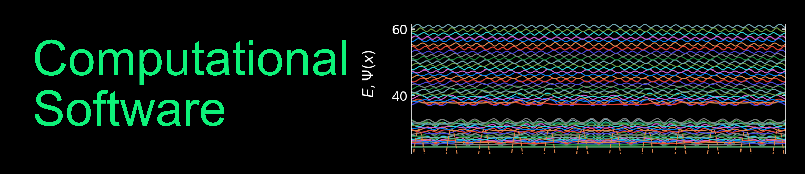

.. Computational Software documentation master file, created by
   sphinx-quickstart on Tue Mar 31 12:45:28 2020.
   You can adapt this file completely to your liking, but it should at least
   contain the root `toctree` directive.

Welcome to the Introduction to Computer-based Physical Modelling Course!
========================================================================

The Python programming language is useful for all kinds of scientific and engineering tasks. You can use it to analyze and plot data. You can also use it to numerically solve scientific problems that are difficult or even impossible to solve analytically. Python is freely available and has been, due to its modular structure, extended with a nearly infinite number of different purpose modules.  

This course intends to introduce you into the programming with Python. It is certainly aimed at the beginner and those of you who are very experienced yet, will to some extend get bored. 

We will start with a basic introduction into the programming language Python. We will show you some basic functionalities, the rading of data, plotting data and analyzing data, which are some of the tasks you will encounter during your physics studies. We will also address fitting of data and an error estimation. During our course we will have a look at physics related problems from 

* mechanics
* electrostatics
* waves
* quantum mechanics
* optics
* machine learrning

We will not present a comprehensive list of numerical simulation schemes, but use the examples to stimulate your curiosity. As there are slight differences in the syntax of different Python versions, we will in the following always refer to **Python 3** standards.

Feel free to ask questions to the contents of the modules.

.. toctree::
   :maxdepth: 2
   :caption: Course Information:
   
   course-info/website.rst
   course-info/schedule.rst
   course-info/assignments.rst
   course-info/exam.rst   
   
.. toctree::
   :maxdepth: 2
   :caption: Jupyter Notebooks:
   
   lectures/Intro/overview.rst
   notebooks/Intro/Introduction2Jupyter.ipynb
   notebooks/Intro/NotebookEditor.ipynb
   notebooks/Intro/EditCells.ipynb

.. toctree::
   :maxdepth: 2
   :caption: Lecture 1:

   lectures/L1/overview_1.rst
   notebooks/L1/1_variables.ipynb
   notebooks/L1/2_operators.ipynb
   notebooks/L1/3_datatypes.ipynb
   notebooks/L1/4_modules.ipynb

.. toctree::
   :maxdepth: 2
   :caption: Lecture 2:

   lectures/L2/overview_2.rst
   notebooks/L2/1_numpy.ipynb   
   notebooks/L2/2_plotting.ipynb
   notebooks/L2/3_randomnumbers.ipynb
   notebooks/L2/4_input_output.ipynb
   

Indices and tables
==================

* :ref:`genindex`
* :ref:`modindex`
* :ref:`search`
